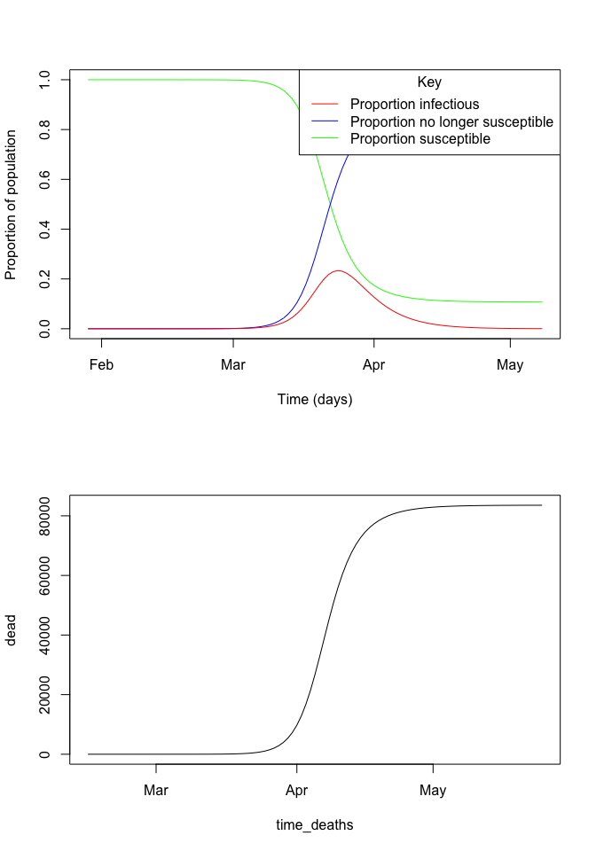

<!-- README.md is generated from README.Rmd. Please edit that file -->

# Implementation of model by Lourenço et al.

Original paper here:
<https://www.dropbox.com/s/oxmu2rwsnhi9j9c/Draft-COVID-19-Model%20%2813%29.pdf?dl=0>

Note that you will also need to download the death data, amazingly
compiled by JHU: <https://github.com/CSSEGISandData/COVID-19>

<!-- badges: start -->

<!-- badges: end -->

``` r
## install.packages("deSolve")
## devtools::install_github("jameshay218/lazymcmc")
library(tidyverse)
#> ── Attaching packages ────────────────────────────────────────────────────────────────────────────────────────────────────────────────────────────────── tidyverse 1.3.0 ──
#> ✓ ggplot2 3.2.1     ✓ purrr   0.3.3
#> ✓ tibble  2.1.3     ✓ dplyr   0.8.4
#> ✓ tidyr   1.0.2     ✓ stringr 1.4.0
#> ✓ readr   1.3.1     ✓ forcats 0.4.0
#> ── Conflicts ───────────────────────────────────────────────────────────────────────────────────────────────────────────────────────────────────── tidyverse_conflicts() ──
#> x dplyr::filter() masks stats::filter()
#> x dplyr::lag()    masks stats::lag()
library(lazymcmc)
library(doParallel)
#> Loading required package: foreach
#> 
#> Attaching package: 'foreach'
#> The following objects are masked from 'package:purrr':
#> 
#>     accumulate, when
#> Loading required package: iterators
#> Loading required package: parallel
library(patchwork)
setwd("~/Documents/GitHub/gupta_model_check")
top_wd <- "~/Documents/GitHub/gupta_model_check"
rerun_fits <- FALSE

n_clusters <- 9
cl <- makeCluster(n_clusters)
registerDoParallel(cl)

mcmcPars1 <- c("iterations"=150000,"popt"=0.44,"opt_freq"=1000,
              "thin"=10,"adaptive_period"=50000,"save_block"=1000)
mcmcPars2 <- c("iterations"=400000,"popt"=0.234,"opt_freq"=1000,
               "thin"=10,"adaptive_period"=100000,"save_block"=1000)

get_index_par <- function(chain, index){
  par_names <- colnames(chain)[2:(ncol(chain)-1)]
  par <- as.numeric(chain[chain$sampno == index, 2:(ncol(chain)-1)])
  names(par) <- par_names
  return(par)
}

runnames <- c("prior_only_lourenco1","prior_only_lourenco2","prior_only_me","fitting_lourenco1","fitting_lourenco2","fitting_me")
n_runs <- length(runnames)
prior_controls <- c(TRUE,TRUE,TRUE,FALSE,FALSE,FALSE)
prior_use <- c(1,2,3,1,2,3)
n_chains <- 3

runnames <- rep(runnames, each=n_chains)
prior_controls <- rep(prior_controls,each=n_chains)
prior_use <- rep(prior_use, each=n_chains)
chain_nos <- rep(1:n_chains, n_runs)

## Define the set of ODEs for the model. Return such that we can solve with deSolve
SIR_odes <- function(t, x, params) {
  y <- x[1]
  z <- x[2]
  dead <- x[3]
  
  ## Extract model parameters
  R0 <- params[1]
  sigma <- params[2]
  rho <- params[3]
  theta <- params[4]
  N <- params[5]
  
  beta <- R0*sigma
  
  dY <- beta*y*(1-z) - sigma*y
  dZ <- beta*y*(1-z)
  
  ## Note need to shift this number forward by psi days post-hoc
  dDead <- N*rho*theta*z
  list(c(dY,dZ,dDead))
}

## ROUGH PARAMETERS FROM THE PAPER
sigma <- 1/3.25 ## 1/Infectious period
R0 <- 2.25 ## Basic reproductive number
rho <- 0.001 ## Proportion of population at risk of severe disease
theta <- 0.14 ## Probability of dying with severe disease
psi <- 17 ## Time between infection and death
t0 <- 0
psi <- 15.5

## Population of UK
N <- 66800000

## EXTRACT AND CLEAN DATA
## Number dead in UK to date
obs_deaths <- read_csv("~/Documents/GitHub/COVID-19/csse_covid_19_data/csse_covid_19_time_series/time_series_covid19_deaths_global.csv")
#> Parsed with column specification:
#> cols(
#>   .default = col_double(),
#>   `Province/State` = col_character(),
#>   `Country/Region` = col_character()
#> )
#> See spec(...) for full column specifications.
obs_deaths <- obs_deaths %>% filter(`Country/Region` == "United Kingdom") %>% select(-c("Province/State","Country/Region","Lat","Long"))
obs_deaths <- colSums(obs_deaths)
obs_deaths <- data.frame(time=names(obs_deaths),dead=obs_deaths)
obs_deaths$time <- as.Date(as.character(obs_deaths$time),origin="2020-01-01", format="%m/%d/%y")
obs_deaths <- obs_deaths %>% filter(time <= "2020-03-19")
obs_deaths <- obs_deaths %>% filter(time >= "2020-03-05")
data <- obs_deaths

## Take a look to see that model makes sense
## Times to solve model over
t <- seq(0,100,by=1)

## Note starting conditions for population size - we're working per capita here
results <- as.data.frame(deSolve::ode(y=c(y=1/N,z=1/N,Dead=0),
                                      times=t, func=SIR_odes,
                                      parms=c(R0,sigma, rho, theta, N)))

## Deaths for that time are actually reported psi days later
results$time_deaths <- results$time + psi
results$susc <- 1 - results$z
results$time <- as.Date(results$time, origin="2020-01-27")
plot(results[,c("time","susc")], type='l',col="green",xlab="Time (days)", ylab="Proportion of population",ylim=c(0,1))
lines(results[,c("time","z")],col="blue")
lines(results[,c("time","y")],col="red")
abline(v=as.Date(results[results$Dead > 1,][1,"time_deaths"],origin="2020-01-27"),lty=2)
legend("topright", title="Key",
       legend=c("Proportion infectious","Proportion no longer susceptible","Proportion susceptible"),
       col=c("red","blue","green"),
       lty=c(1,1,1))
```

<!-- -->

``` r


##################################
## NOW SET UP CODE TO FIT MODEL

t_long <- seq(0,365,by=1)
pars <- c(R0, sigma, rho, theta, N, psi, t0)
names(pars) <- c("R0","sigma","rho","theta","N","psi","t0")
## Putting model solving code in a function for later use
solve_model <- function(pars, t){
  N <- pars["N"]
  psi <- pars["psi"]
  t0 <- pars["t0"]
  ## Note starting conditions for population size - we're working per capita here
  results <- as.data.frame(deSolve::ode(y=c(y=1/N,z=1/N,Dead=0),
                                        times=t, func=SIR_odes,
                                        parms=pars))

  ## For solve deaths, shift forward in time as will only be observed
  ## t0 + psi days after t=0
  predicted <- results %>% 
    mutate(time = as.integer(time + t0 + psi)) %>%
    mutate(time = as.Date(time, origin="2020-01-01"))
  
  return(predicted)
}

## We need to put our likleihood function in a closure environment
## It's important to write the function in this form!
create_lik <- function(parTab, data, PRIOR_FUNC,t, PRIOR_ONLY=FALSE){
  par_names <- parTab$names
  
  ## Extract observed incidence
  obs_dead <- data$dead
  max_time <- max(data$time)
  min_time <- min(data$time)
  
  likelihood_func <- function(pars){
    names(pars) <- par_names
    ## Solve model
    if(!PRIOR_ONLY){
      predicted <- solve_model(pars, t)
      
      ## Get deaths that match data
      predicted1 <-  predicted %>%
        filter(time <= max_time & time >= min_time) %>% pull(Dead)
      lik <- sum(dpois(x=obs_dead,lambda=predicted1,log=TRUE))
    } else {
      lik <- 0
    }
    if(!is.null(PRIOR_FUNC)) lik <- lik + PRIOR_FUNC(pars)
    lik
  }
}

## Control parameters in MCMC
parTab <- data.frame(names=c("R0","sigma", "rho", "theta", "N", "psi", "t0"),
                     values=pars,
                     fixed=c(0,0,0,0,1,0,0),
                     steps=c(0.1,0.1,0.1,0.1,0.1,0.1,0.1),
                     lower_bound=c(1,0,0,0,0,0,0),
                     upper_bound=c(10,10,0.1,10,100000000,25,45))


## Test the model solves
f <- create_lik(parTab, data, NULL, t=t_long)
f(pars)
#> [1] -1256892
## Starting points, chosen pseudo at random
## seeding chains for SIR models is hard with deSolve,
## so I've chosen points near the true values.
startTab <- parTab

prior_func_lourenco1 <- function(pars){
  names(pars) <- parTab$names
  p1 <- dnorm(pars["R0"], 2.25, 0.025,log=TRUE)
  p2 <- dnorm(1/pars["sigma"], 4.5, 1, log=TRUE)
  p3 <- dnorm(pars["psi"], 17, 2, log=TRUE)
  p4 <- dgamma(pars["rho"], shape=5,rate=5/0.001,log=TRUE)
  p5 <- dnorm(pars["theta"],0.14,0.007,log=TRUE)
  return(sum(p1,p2,p3,p4,p5))
}
prior_func_lourenco2 <- function(pars){
  names(pars) <- parTab$names
  p1 <- dnorm(pars["R0"], 2.75, 0.025,log=TRUE)
  p2 <- dnorm(1/pars["sigma"], 4.5, 1, log=TRUE)
  p3 <- dnorm(pars["psi"], 17, 2, log=TRUE)
  p4 <- dgamma(pars["rho"], shape=5,rate=5/0.01,log=TRUE)
  p5 <- dnorm(pars["theta"],0.14,0.007,log=TRUE)
  return(sum(p1,p2,p3,p4,p5))
}

prior_func_me <- function(pars){
  names(pars) <- parTab$names
  p1 <- dnorm(pars["R0"], 2.5, 0.5,log=TRUE)
  p2 <- dnorm(1/pars["sigma"], 4.5, 1, log=TRUE)
  p3 <- dnorm(pars["psi"], 17, 2, log=TRUE)
  p4 <- 0
  p5 <- dnorm(pars["theta"],0.14,0.007,log=TRUE)
  return(sum(p1,p2,p3,p4,p5))
}

if(rerun_fits){
  res <- foreach(i=seq_along(runnames),.packages=c("lazymcmc","tidyverse")) %dopar% {
    setwd(top_wd)
    setwd("chains2")
    
    if(!file.exists(runnames[i])) {
      dir.create(runnames[i])
    }
    setwd(runnames[i])
    
    filename_tmp <- paste0(runnames[i],"_",chain_nos[i])
    prior_only <- prior_controls[i]
    prior_use_tmp <- prior_use[i]
    
    if(prior_use_tmp == 1){
      prior_func <- prior_func_lourenco1
    } else if(prior_use_tmp == 2) {
      prior_func <- prior_func_lourenco2
    } else {
      prior_func <- prior_func_me
    }
    
    output <- run_MCMC(parTab=startTab, data=obs_deaths, mcmcPars=mcmcPars1, filename=filename_tmp,
                       CREATE_POSTERIOR_FUNC = create_lik, mvrPars = NULL, PRIOR_FUNC=prior_func, t=t_long,
                       PRIOR_ONLY=prior_only)
    chain <- read.csv(output$file)
    best_pars <- get_best_pars(chain)
    chain <- chain[chain$sampno >= mcmcPars1["adaptive_period"],2:(ncol(chain)-1)]
    covMat <- cov(chain)
    mvrPars <- list(covMat,0.5,w=0.8)
    
    ## Start from best location of previous chain
    startTab$values <- best_pars
    
    ## Run second chain
    output <- run_MCMC(parTab=startTab, data=obs_deaths, mcmcPars=mcmcPars2, filename=filename_tmp,
                       CREATE_POSTERIOR_FUNC = create_lik,PRIOR_FUNC=prior_func, t=t_long,
                       PRIOR_ONLY=prior_only, mvrPars=mvrPars)
  }
}
  

## Read in the MCMC chains
setwd(top_wd)
setwd("chains2")
```

``` r
all_runs <- list.files(paste0(top_wd,"/chains2"))
all_chains <- NULL
for(run in all_runs){
  chains <- load_mcmc_chains(paste0(top_wd, "/chains2/",run),parTab,TRUE,1,mcmcPars2["adaptive_period"])
  
  tmp_chain <- as.data.frame(chains[[2]])
  tmp_chain$sampno <- 1:nrow(tmp_chain)
  tmp_chain$run <- run
  tmp_chain <- reshape2::melt(tmp_chain, id.vars=c("sampno","run"))
  all_chains <- rbind(all_chains, tmp_chain)
  
  #pdf(paste0(top_wd,"/",run,"_chains.pdf"))
  #plot(chains[[1]])
  #dev.off()
}
#> [1] "/Users/james/Documents/GitHub/gupta_model_check/chains2/fitting_lourenco1/fitting_lourenco1_1_multivariate_chain.csv"
#> [2] "/Users/james/Documents/GitHub/gupta_model_check/chains2/fitting_lourenco1/fitting_lourenco1_2_multivariate_chain.csv"
#> [3] "/Users/james/Documents/GitHub/gupta_model_check/chains2/fitting_lourenco1/fitting_lourenco1_3_multivariate_chain.csv"
#> [[1]]
#> [1] 40001
#> 
#> [[2]]
#> [1] 40001
#> 
#> [[3]]
#> [1] 40001
#> 
#> [1] "/Users/james/Documents/GitHub/gupta_model_check/chains2/fitting_lourenco2/fitting_lourenco2_1_multivariate_chain.csv"
#> [2] "/Users/james/Documents/GitHub/gupta_model_check/chains2/fitting_lourenco2/fitting_lourenco2_2_multivariate_chain.csv"
#> [3] "/Users/james/Documents/GitHub/gupta_model_check/chains2/fitting_lourenco2/fitting_lourenco2_3_multivariate_chain.csv"
#> [[1]]
#> [1] 40001
#> 
#> [[2]]
#> [1] 40001
#> 
#> [[3]]
#> [1] 40001
#> 
#> [1] "/Users/james/Documents/GitHub/gupta_model_check/chains2/fitting_me/fitting_me_1_multivariate_chain.csv"
#> [2] "/Users/james/Documents/GitHub/gupta_model_check/chains2/fitting_me/fitting_me_2_multivariate_chain.csv"
#> [3] "/Users/james/Documents/GitHub/gupta_model_check/chains2/fitting_me/fitting_me_3_multivariate_chain.csv"
#> [[1]]
#> [1] 40001
#> 
#> [[2]]
#> [1] 40001
#> 
#> [[3]]
#> [1] 40001
#> 
#> [1] "/Users/james/Documents/GitHub/gupta_model_check/chains2/prior_only_lourenco1/prior_only_lourenco1_1_multivariate_chain.csv"
#> [2] "/Users/james/Documents/GitHub/gupta_model_check/chains2/prior_only_lourenco1/prior_only_lourenco1_2_multivariate_chain.csv"
#> [3] "/Users/james/Documents/GitHub/gupta_model_check/chains2/prior_only_lourenco1/prior_only_lourenco1_3_multivariate_chain.csv"
#> [[1]]
#> [1] 40001
#> 
#> [[2]]
#> [1] 40001
#> 
#> [[3]]
#> [1] 40001
#> 
#> [1] "/Users/james/Documents/GitHub/gupta_model_check/chains2/prior_only_lourenco2/prior_only_lourenco2_1_multivariate_chain.csv"
#> [2] "/Users/james/Documents/GitHub/gupta_model_check/chains2/prior_only_lourenco2/prior_only_lourenco2_2_multivariate_chain.csv"
#> [3] "/Users/james/Documents/GitHub/gupta_model_check/chains2/prior_only_lourenco2/prior_only_lourenco2_3_multivariate_chain.csv"
#> [[1]]
#> [1] 40001
#> 
#> [[2]]
#> [1] 40001
#> 
#> [[3]]
#> [1] 40001
#> 
#> [1] "/Users/james/Documents/GitHub/gupta_model_check/chains2/prior_only_me/prior_only_me_1_multivariate_chain.csv"
#> [2] "/Users/james/Documents/GitHub/gupta_model_check/chains2/prior_only_me/prior_only_me_2_multivariate_chain.csv"
#> [3] "/Users/james/Documents/GitHub/gupta_model_check/chains2/prior_only_me/prior_only_me_3_multivariate_chain.csv"
#> [[1]]
#> [1] 40001
#> 
#> [[2]]
#> [1] 40001
#> 
#> [[3]]
#> [1] 40001
```

``` r
all_chains1 <- all_chains
all_chains <- all_chains %>% mutate(value=ifelse(variable=="sigma", 1/value, value))
all_chains$group <- "new"
all_chains <- all_chains %>% mutate(group = ifelse(run %in% c("fitting_lourenco1","prior_only_lourenco1"), "original_low", group),
                                    group = ifelse(run %in% c("fitting_lourenco2","prior_only_lourenco2"), "original_high",group))

var_key <- c("R0"="R[0]",
             "sigma"="sigma",
             "rho"="rho",
             "theta"="theta",
             "psi"="phi",
             "t0"="Seed_date",
             "lnlike"="Posterior_probability")

run_names_key <- c("fitting_lourenco1"="After fitting to data, original",
                   "prior_only_lourenco1"="Before fitting to data, original",
                   "fitting_lourenco2"="After fitting to data, original",
                   "prior_only_lourenco2"="Before fitting to data, original",
                   "fitting_me"="After fitting to data, my analysis",
                   "prior_only_me"="Before fitting to data, new")

all_chains$run <- run_names_key[all_chains$run]

all_chains$variable <- var_key[all_chains$variable]
all_chains$variable <- factor(all_chains$variable, levels=var_key)

colnames(all_chains)[2] <- "Version"

blank_limits <- data.frame(variable=c("R[0]","R[0]","rho","rho"),x=c(1,4,0,0.1))


## Plot the posteriors and priors
p1 <- ggplot(all_chains[all_chains$group == "original_low",]) + 
  geom_density(aes(x=value,fill=Version), alpha=0.5) +
  geom_blank(data=blank_limits,aes(x=x))+
  scale_fill_manual(values=c("#E69F00", "#56B4E9")) +
  facet_wrap(~variable,scales="free",ncol=3, labeller=label_parsed) + 
  xlab("Estimate") + ylab("Posterior density") +
  theme_bw() +
  theme(legend.position=c(0.7,0.2))
p2 <- ggplot(all_chains[all_chains$group == "original_high",]) + 
  geom_density(aes(x=value,fill=Version), alpha=0.5) +
  geom_blank(data=blank_limits,aes(x=x))+
  scale_fill_manual(values=c("#E69F00", "#56B4E9")) +
  facet_wrap(~variable,scales="free",ncol=3, labeller=label_parsed) + 
  xlab("Estimate") + ylab("Posterior density") +
  theme_bw() +
  theme(legend.position=c(0.7,0.2))
p3 <- ggplot(all_chains[all_chains$group == "new",]) + 
  geom_density(aes(x=value,fill=Version), alpha=0.5) + 
  scale_fill_manual(values=c("#E69F00", "#56B4E9")) +
  geom_blank(data=blank_limits,aes(x=x))+
  facet_wrap(~variable,scales="free",ncol=3, labeller=label_parsed) +
  xlab("Estimate") + ylab("Posterior density") +
  theme_bw() +
  theme(legend.position=c(0.7,0.2))

#png("densities_original_low.png",height=5,width=8,res=300,units="in")
#p1
#dev.off()

#png("densities_original_high.png",height=5,width=8,res=300,units="in")
#p2
#dev.off()

#png("densities_new.png",height=5,width=8,res=300,units="in")
#p3
#dev.off()

all_chains_subset <- all_chains %>% filter(Version %in% c("After fitting to data, original", "After fitting to data, my analysis") & variable %in% var_key[names(var_key) %in% c("R0","sigma","rho","t0")])
all_chains_subset$variable <- as.character(all_chains_subset$variable)
all_chains_subset <- all_chains_subset %>% pivot_wider(names_from=variable,values_from=value)

## Plot the 2D densities
p4 <- ggplot(all_chains_subset) + 
  geom_hex(aes(x=`sigma`,y=`R[0]`,fill=..density..),bins=100) +
  ylab("Basic reproductive number") + xlab("Infectious period in days") +
  facet_wrap(~Version) +
  scale_fill_gradient2(low="#5E4FA2",mid="#FAFDB8",high="#9E0142",midpoint= 0.008) +
  theme_bw()

p5 <- ggplot(all_chains_subset) + 
  geom_hex(aes(y=`rho`,x=as.Date(`Seed_date`,origin="2020-01-01"),fill=..density..),bins=100) +
  xlab("Seed date") + ylab("Proportion of population at\n risk of severe disease") +
  scale_fill_gradient2(low="#5E4FA2",mid="#FAFDB8",high="#9E0142",midpoint= 0.008) +
  facet_wrap(~Version) + theme_bw()

#png("correlations.png",height=6,width=8,res=300,units="in")
#p4/p5
#dev.off()


## Calculate 95% CI on proportion infected
setwd(top_wd)
setwd("chains2")
run <- "fitting_me/"
chains <- load_mcmc_chains(paste0(top_wd, "/chains2/",run),parTab,FALSE,1,mcmcPars2["adaptive_period"])
#> [1] "/Users/james/Documents/GitHub/gupta_model_check/chains2/fitting_me//fitting_me_1_multivariate_chain.csv"
#> [2] "/Users/james/Documents/GitHub/gupta_model_check/chains2/fitting_me//fitting_me_2_multivariate_chain.csv"
#> [3] "/Users/james/Documents/GitHub/gupta_model_check/chains2/fitting_me//fitting_me_3_multivariate_chain.csv"
#> [[1]]
#> [1] 40001
#> 
#> [[2]]
#> [1] 40001
#> 
#> [[3]]
#> [1] 40001
chain <- as.data.frame(chains[[2]])  
chain$sampno <- 1:nrow(chain)
samps <- sample(unique(chain$sampno), 10000)

solve_model2 <- function(pars, t){
  N <- pars["N"]
  psi <- pars["psi"]
  t0 <- pars["t0"]
  ## Note starting conditions for population size - we're working per capita here
  results <- as.data.frame(deSolve::ode(y=c(y=1/N,z=1/N,Dead=0),
                                        times=t, func=SIR_odes,
                                        parms=pars))
  
  ## To solve for real time, shift forward by t0 days
  predicted <- results %>% 
    mutate(time = as.integer(time + t0)) %>%
    mutate(time = as.Date(time, origin="2020-01-01"))
  
  return(predicted)
}

prop_infected <- numeric(10000)
rhos <- numeric(10000)
for(i in seq_along(samps)){
  pars <- get_index_par(chain, samps[i])
  res <- solve_model2(pars, t_long)
  rhos[i] <- pars["rho"]
  prop_infected[i] <- res[res$time == "2020-03-19","z.N"]
}
print(paste0("Proportion immune: ", quantile(prop_infected,c(0.025,0.5, 0.975))*100))
#> [1] "Proportion immune: 0.71084860482293" "Proportion immune: 4.57972600696198"
#> [3] "Proportion immune: 57.0114400637053"

final_dat <- data.frame(rho=rhos,prop_infected=prop_infected)

p7 <- ggplot(final_dat) + 
  geom_hex(aes(y=`rho`,x=prop_infected,fill=..density..),bins=100) +
  xlab("Proportion of UK population immune by 19/03/2020") + ylab("Proportion of population at\n risk of severe disease") +
  scale_fill_gradient2(low="#5E4FA2",mid="#FAFDB8",high="#9E0142",midpoint= 0.0015) + theme_bw() + theme(legend.position=c(0.8,0.7))
#png("final_new.png",height=4,width=5,res=300,units="in")
#p7
#dev.off()
```
